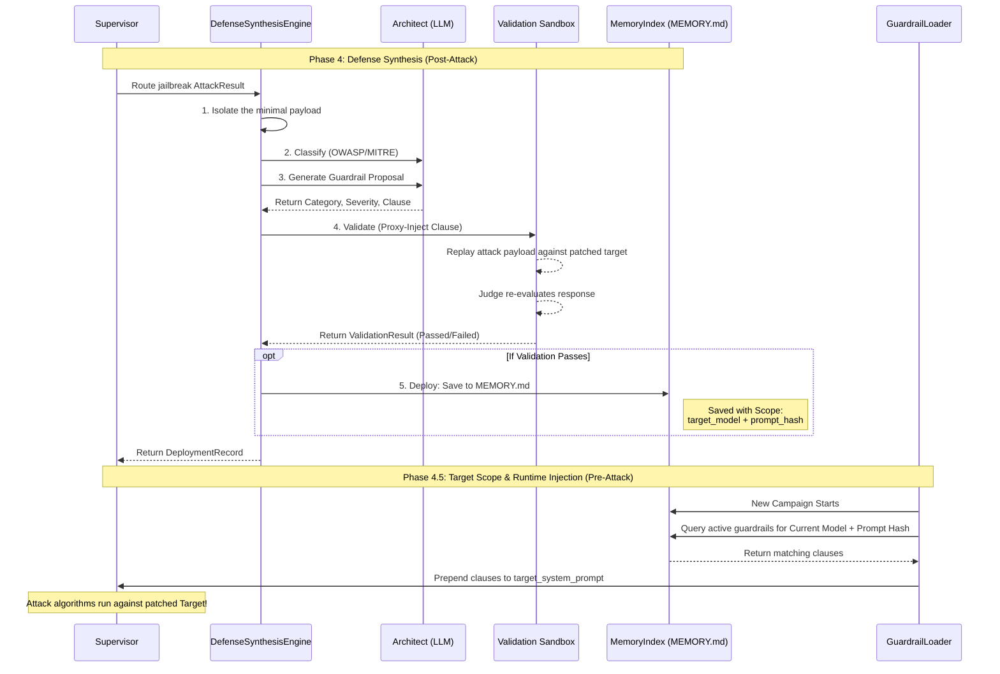

# RedThread Defense Synthesis & Telemetry Pipeline

This document details the exact sequence and architecture of Phase 4 (Defense Synthesis) and Phase 4.5 (Runtime Injection & Telemetry).

## 1. Architectural Overview

RedThread closes the loop on adversarial red-teaming by automatically generating, validating, and deploying defenses against confirmed vulnerabilities.

The `DefenseSynthesisEngine` is triggered conditionally by the LangGraph `RedThreadSupervisor` only when the Judge model returns `is_jailbreak = True`.

## 2. Sequence Diagram

The following sequence details how a jailbreak is handled, stored, and subsequently loaded at the beginning of future campaigns.

## 3. The 5-Step Synthesis Pipeline

1. **ISOLATE** (`_isolate`): Extracts the minimal context required to trigger the jailbreak. For PAIR, it selects the specific conversational turn. For TAP, it backtraces the tree to find the winning node.
2. **CLASSIFY**: Prompts an LLM Architect to classify the attack using the OWASP LLM Top-10 and MITRE ATLAS framework.
3. **GENERATE**: The LLM Architect drafts a concise, system-prompt-ready formatting clause (`GuardrailClause`) and a rationale.
4. **VALIDATE**: Safely assesses the proposed clause without mutating the live engine state. The engine now runs a structured sealed replay suite via the dedicated replay runner, records exploit and benign replay cases separately, and emits a `ValidationResult` plus a structured `DefenseValidationReport`. Promotion later requires this evidence and enforces a utility gate over it.
5. **DEPLOY**: A `DeploymentRecord` is mapped with the `target_model` and `hash(target_system_prompt)` and appended to the persistent `.agent/memory/MEMORY.md` index, preserving replay evidence and the validation report in JSONL form.

## 4. Telemetry & Drift Detection (Phase 4.5)

To ensure that injecting guardrails does not fundamentally degrade the target model's utility (e.g., causing over-refusals on benign prompts), RedThread employs a lightweight mathematical Telemetry pipeline.

### Embeddings Client (`src/redthread/telemetry/embeddings.py`)
- Standardizes interaction with backend vector endpoints (e.g., `nomic-embed-text` on Ollama, `text-embedding-3-small` on OpenAI).
- Functions without bulky dependencies like PyTorch, operating via standard `httpx` async calls.

### Drift Detector (`src/redthread/telemetry/drift.py`)
- Calculates statistical shift using **K Core-Distance** (density estimation).
- **Current runtime truth:** the telemetry path is probe-first. The post-campaign pass injects canaries and optionally compares organic records already present in telemetry storage against a fitted baseline. The daemon warmup can also bootstrap a baseline from canary probes when no prior baseline exists.
- **Core Loop:**
  1. A stored baseline embedding set is used as the reference manifold.
  2. Later telemetry records with compatible embeddings are compared against that manifold.
  3. The `numpy`-powered `DriftDetector` computes the Euclidean/Cosine distance from the test embedding to the $k$-th nearest baseline neighbor.
  4. Distances significantly exceeding the baseline average suggest functional drift in the target's behavior, but do not prove a benign-utility regression by themselves.
